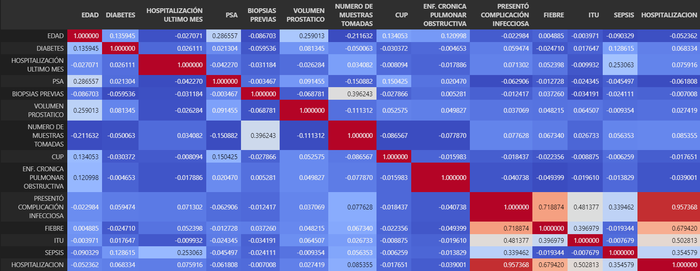
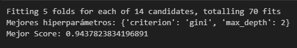
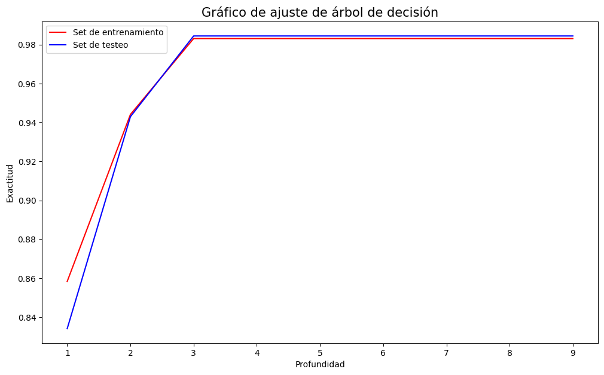
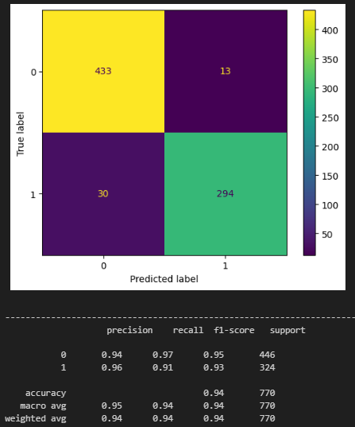

# **Proyecto Integrador**

# **Introducción**

Actualmente , el cáncer es uno de los principales problemas de salud y el principal causa de muerte a nivel mundial, de acuerdo con la Organización Mundial de la Salud (OMS), siendo el  cáncer de próstata el cuarto más común.

Hoy en día, se utilizan pruebas de laboratorio, pruebas con imágenes y biopsias para la detección de esta enfermedad. Si hablamos del cáncer de próstata, los métodos más usados son: prueba de PSA, ultrasonidos y biopsias. Éste último método, a veces genera complicaciones mayores que pueden poner en riesgo la vida del paciente, después de su procedimiento.

Por eso, este proyecto plantea el desarrollo de un sistema Machine Learning que nos permitirá emitir el diagnótico del paciente, evaluar la efectividad de estrategias de intervención y anticipar comportamientos en escenarios relacionados con la atención médica de un hospital. Dicho sistema, nos va a servir como auxiliar para identificar las características más importantes que tienen en común los pacientes sometidos a una biopsia prostática, y posteriormente, terminan en hopitalización.
 
# **Planteamiento de la problemática**

Este proyecto fue diseñado específicamente para uno de nuestros clientes, quien desea realizar un estudio de atención médica en salud para su hospital.

Nuestro cliente quiere conocer cuales son características principales que tienen los pacientes a los que se les han realizado biopsias prostáticas, y que después del procedimiento, tienen complicaciones mayores, de manera que terminan hospitalizados. Para esto, se definieron los siguientes términos:
1. Como caso, se fijaron los pacientes sometidos a una biopsia prostática y que en un periodo máximo de 30 días posteriores al procedimiento presentaron fiebre, infección urinaria o sepsis; requiriendo manejo médico ambulatorio u hospitalizado para la resolución de la complicación.
2. Como control, fueron asignados los pacientes que fueron sometido a una biopsia prostática y que no presentaron complicaciones infecciosas en el período de 30 días posteriores al procedimiento.

Para ello, hemos hecho una recopilación de datos que nos servirán para el desarrollo del sistema`Antecedentes del paciente`, `Morbilidad asociada al paciente` y `Antecedentes relacionados con la toma de la biopsia`y `Complicaciones infecciosas`. En la siguiente tabla (´_Fig. 1_´), se encuentra un diccionario de datos asociados:

_`Fig. 1. Diccionario de datos asociados.`_

 # **Metodología**

# Análisis exploratorio de datos

Se realizó un análisis explotatorio de datos (EDA),en donde:

1. Se comprendieron los datos en cuanto a su estructura, contenido y calidad.
2. Se eliminaron las columnas irrelevantes para nuestro Modelo.
3. Corregimos y eliminamos valores atípicos y valores nulos. 
4. Transformamos nuestras variables categóricas a variables numéricas, para su próxima utilización en Machine Learning.
5. Hicimos una matriz de correlación, y utilizamos para el posterior solo las 3 mejores variables correlacionadas a nuestra varible objetivo.
6. Se realizó una técnica de sobremuestreo como preprocesamiento de datos, debido a la desproporción de datos positivos y negativos.

# Modelos Machine Learning

Se desarrollaron 3 diferentes modelos de Machine learning con la base de datos, con y sin sobremuestreo para su comparaión, los cuales fueron KNeighborsClassifier, DecisionTreeClassifier y Scalable Linear Support Vector Machine, en donde de cada modelo hicimos lo siguiente:

1. Definimos nuestras variables predictoras y la variable objetivo, así como nuestros datos de entrenamiento y testeo.
2. Utilizamos la técnica de ´_Grid Search Cross-Validation_´ para elegir los mejores datos hiperparámetros, y así, evaluamos el rendimiento de éstos mediante validación cruzada.
3. Se entrenó cada modelo con los párametros óptimos que se obtuvieron anteriormente.
4. Graficamos y visualizamos ´_Matriz de Confusión_´ para facilitar el analisis de modelo y sus indicadores de precisión y exactitud.
5. Evaluamos las tasas de verdaderos positivos y falsos positivos para cada clase por medio de ´_Curvas de ROC_´
6. Realizamos un ´_Gráfico de ajuste_´, variando el parámetro mas determinante en cada modelo y así observar su comportamiento y su precisión.

# **Interpretación de resultado y conclusiones**

# Análisis exploratorio de datos

A través de la matriz de correlación de los datos sobremuestreados realizada en el EDA (´_Fig. 2_´), en función a la problemática planteada, encontramos que las características más influyentes en la hospitalización del paciente son las siguientes:
- FIEBRE
- ITU 
- SEPSIS, la cuál fue definida previamente por el equipo

_`Fig. 2. Matriz de correlación de los datos sobremuestreados.`_
  
  
# Modelos

En las pruebas que se realizaron con distintos modelos, se determinó que los modelos que tuvieron menos eficacia con respecto en su funcionamiento fueron: KNeighborsClassifier y Scalable Linear Support Vector Machine. De esta manera, se estableció como el mejor, al DecisionTreeClassifier en cuanto a los parámetros de precisión y exactitud. A continuación, se observan los resultados de nuestro mejor Modelo (DecisionTreeClassifier).
  
## GridSearch

 Los valores óptimos de los hiperparámetros **`'max_depth' y 'criterion'`** que obtuvimos gracias a la técnica de  **_Grid Search Cross-Validation_**  se muestran en ´_Fig. 3_´, los cuales fueron los utilizados para el entrenamiento del modelo DecisionTreeClassifier.

_`Fig. 3. Mejores hiperparámetros`_

## **Relación exactitud/profundidad**
En la ´_Fig. 4_´, podemos ver el gráfico que muestra la relación de exactitud y profundidad del árbol de decisión, en el cual variamos el parámetro de profundidad. Y efectivamente, podemos ver que la mayor exactitud de nuestro modelo DecisionTreeClassifier se presenta cuando nuestro parámetro de profundidad tiene un valor de 2, coincidiendo con nuestros resultados en  **_Grid Search Cross-Validation_**.

_`Fig. 4. Exactitud con respecto a la profundidad del árbol de decisión en el modelo`_

## **Matriz de confusión**
Para finalizar, podemos concluir con nuestra matriz de confusión de nuestro modelo de testeo, en donde se muestran los valores de sensibilidady especificidad, así como, la exactitud y la precisión con un factor de .94. 

_`Matriz de confusión con el set de testeo en KNeighborsClassifier`_

Se deduce que nuestro Modelo DecisionTreeClassifier es una buena alternativa para que los médicos, enfermeros (as) y personas que trabajan en el sector salud, correspondiente al área de urología y/u oncología, puedan predecir cuando un paciente sometido a una biopsia protática es más propenso a ser hopitalizado con una exactitud y precisión del 94%.
